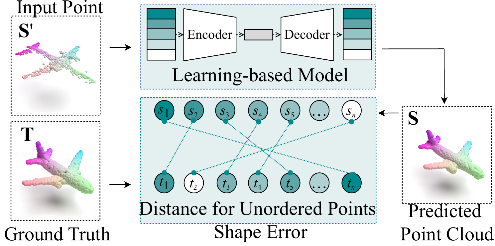
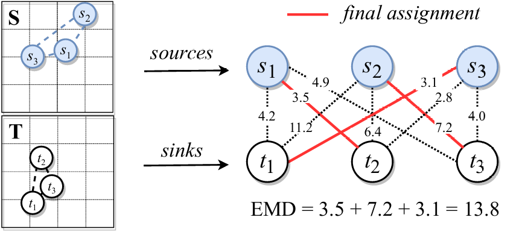

# A Computation-aware Shape Loss Function for Point Cloud Completion [[Paper](https://ojs.aaai.org/index.php/AAAI/article/view/28558)]
<p align="center">
    
</p>
## Version 1.1 (Update at 15/01/2025)
New: We have updated the zigzag order to enhance the locality of the point cloud. 

This repository is still under development, and we have updated a demo version for everyone to verify its functionality.

### Data set for this small demo
10 different point clouds, repeat 8 times for each.

### Run AAIP compare with emd2.py to see our improvement.
**Experimental Environment:**  

AMD Ryzen 7 7435HS with 16 threads 

L1 Cache：512KB L2 Cache:4.0MB L3 Cache: 16MB

GPU: 4070 Laptop with 12GB shared memory


**Average Time Cost: AAIP: 0.498 emd2: 0.1686**

**Average MSE(small better): AAIP_MSE: 103.615 emd2_MSE: 3120.06**

### Method 
<p align="center">
    
</p>
Two point clouds are regarded as sources and sinks, with the objective of finding an one-to-one mapping of three-dimensional points that satisfy optimization conditions. Finally, the global minimum distance EMD is determined.


### Usage

#### 1) Envrionment & prerequisites
- Pytorch 1.12.1
- CUDA 11.6
- Python 3.10
- [Visdom](https://github.com/facebookresearch/visdom)
- [Open3D](http://www.open3d.org/docs/release/index.html#python-api-index)

#### 2) Compile
Compile our EMD modules:  
```
    cd emd
    python3 setup.py install
```

#### 3) Utilize zigzag order to enhance the locality of the input point cloud.
The demo point cloud data has already given a good order
```
    encodePRE.py
```

#### 3) Compare AAIP and emd2
```
    python AAIP compare with emd2.py
```

#### 4) Output log file 
    emd_value_comparison.txt
    time_cost_comparison.txt

#### 5) Calculate MSE
```
    g++ -O3 -o comparison_MSE1 cal_MSE.cpp
    ./comparison_MSE1
```

#### 6) License
This project Code is released under the Apache License 2.0 (refer to the LICENSE file for details).

#### 7) Acknowledgments
Our code is partially based on `MSN-Point-Cloud-Completion` by Liu et al. 
We greatly appreciate their outstanding contribution. 
You can explore their code through the following [link](https://github.com/Colin97/MSN-Point-Cloud-Completion) to appreciate their work.
